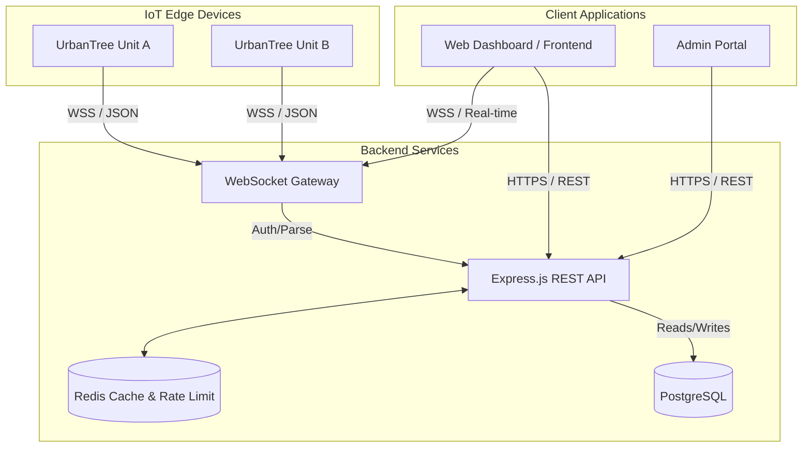

# System Architecture

The UrbanTree platform bridges hardware-level IoT edge devices with a high-performance web dashboard. This document details the architectural decisions, data flow, and software design patterns that make the system scalable, secure, and resilient.

## 1. High-Level Architecture Diagram

## 2. Backend Design Patterns

The backend follows a strict **Controller-Service-Model** pattern leveraging TypeScript and Prisma. 

- **Controllers (`/controllers`):** Responsible solely for parsing HTTP requests, validating inputs via Zod, and returning HTTP responses. They contain no business logic.
- **Services (`/services`):** The core business logic layer. Controllers call services to process data, generate reports, or trigger commands. 
- **Models (`/prisma`):** Handled via Prisma Client for type-safe database interactions.
- **WebSockets (`/websocket`):** A dedicated layer for handling persistent connections from IoT devices. Data is authenticated via timing-safe key checks, parsed, and immediately dispatched to Services for database insertion (e.g., `SensorReadings`).

### Performance Profiling
The application uses `@sentry/profiling-node` to trace CPU cycles and identify performance bottlenecks in production, specifically ensuring the WebSocket parsing loops do not block the V8 Main Thread.

## 3. Frontend Rendering Optimization

The frontend is built for extreme performance, avoiding hefty frameworks like React in favor of vanilla ES6 modules, Vite, and GSAP.

### Scroll-Snapping & GSAP
- The page relies on native CSS `scroll-snap-type` for hardware-accelerated snapping, rather than JavaScript-based scroll hijacking, resulting in zero jank.
- **Intersection Observers:** GSAP animations are intrinsically linked to Intersection Observers. Rather than attaching generic `scroll` event listeners (which trigger layout thrashing), animations only calculate and run when the specific `section` intersects the viewport.
- **Asset Delivery:** Vite bundles and minifies the assets, while the static file structure natively caches images via standard HTTP headers.

## 4. Telemetry Data Flow

When an UrbanTree device emits a telemetry packet (AQI, PM levels, Filter Status):
1. **Ingestion:** The payload is received by the `ws` server.
2. **Validation:** The payload shape is validated using Zod.
3. **Database Write:** The data is pushed to PostgreSQL via Prisma.
4. **Broadcast:** If an admin dashboard is actively viewing that `zoneId`, the WebSocket server broadcasts the new state down to the browser.
5. **Alerting:** A background job evaluates the AQI thresholds. If `AQI > 300`, a high severity `Alert` record is generated and a notification is dispatched.
