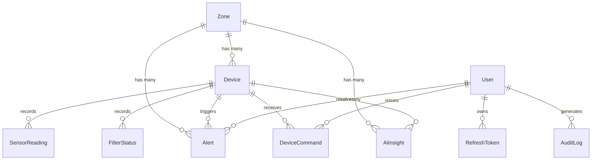

# Database Schema

The backend uses PostgreSQL managed via Prisma ORM. Below is the Entity Relationship Diagram and detailed table definitions representing the core telemetry, user management, and alerting subsystems.

## Entity Relationship Diagram (ERD)

## Core Tables

### `devices`
Represents physical UrbanTree purification units deployed in the field.

| Column | Type | Default | Description |
|---|---|---|---|
| `id` | String | *Required* | Unique serial number/identifier |
| `zone_id` | String | *Foreign Key* | Link to `zones.id` |
| `status` | Enum | `OFFLINE` | `ONLINE`, `OFFLINE`, `MAINTENANCE` |
| `power_source` | Enum | `SOLAR` | `SOLAR`, `GRID`, `BATTERY` |
| `lat` / `lng` | Float? | `null` | Geographical coordinates |
| `fan_speed` | Int | `80` | Current RPM percentage |

### `zones`
Logical grouping of devices (e.g., a specific tech park or city).

| Column | Type | Default | Description |
|---|---|---|---|
| `id` | String | UUID | Primary Key |
| `name` | String | *Required* | Human-readable name |
| `slug` | String | *Unique* | URL-friendly identifier |
| `before_aqi` | Int | *Required* | Environmental AQI prior to installation |
| `after_aqi` | Int | *Required* | Purified AQI within the zone |

### `sensor_readings`
High-frequency telemetry data inserted via WebSockets.

| Column | Type | Default | Description |
|---|---|---|---|
| `id` | String | UUID | Primary Key |
| `device_id` | String | *Foreign Key* | Link to `devices.id` |
| `aqi` | Int | *Required* | Air Quality Index |
| `pm25` | Float? | `null` | Particulate Matter 2.5 |
| `co2` | Int? | `null` | CO2 parts per million |
| `recorded_at`| DateTime| `now()` | Timestamp of telemetry generation |

### `alerts`
System-generated alerts based on thresholds (e.g., AQI spikes, filter degradation).

| Column | Type | Default | Description |
|---|---|---|---|
| `id` | String | UUID | Primary Key |
| `type` | Enum | *Required* | e.g. `HIGH_POLLUTION`, `HEPA_LOW` |
| `severity` | Enum | `WARNING` | `INFO`, `WARNING`, `CRITICAL` |
| `message` | String | *Required* | Alert context/description |
| `is_read` | Boolean| `false` | Dashboard read receipt |
| `resolved_by`| String? | *Foreign Key* | `users.id` of resolver |

### `users`
Dashboard administrators and technicians.

| Column | Type | Default | Description |
|---|---|---|---|
| `id` | String | UUID | Primary Key |
| `email` | String | *Unique* | Login identity |
| `password_hash`| String | *Required* | Bcrypt hash |
| `role` | Enum | `TECHNICIAN` | `SUPER_ADMIN`, `GOVT_ADMIN`, `TECHNICIAN` |
| `is_active` | Boolean| `true` | Access revocation flag |

### `ai_insights`
Predictive analytics records generated by background ML workers to forecast filter degradation or pollution trends.

| Column | Type | Default | Description |
|---|---|---|---|
| `id` | String | UUID | Primary Key |
| `message` | String | *Required* | e.g., "HEPA expected to fail in 14 days" |
| `confidence` | Float | *Required* | Prediction certainty (0.0 - 1.0) |
| `model_version`| String | *Required* | Analytics model tracking |

---

*For full constraints and index definitions, refer to `Backend/prisma/schema.prisma`.*
